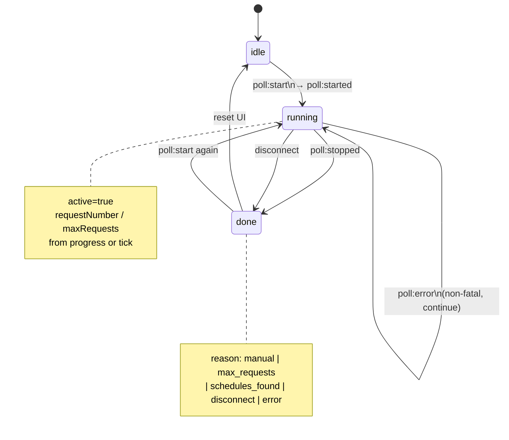
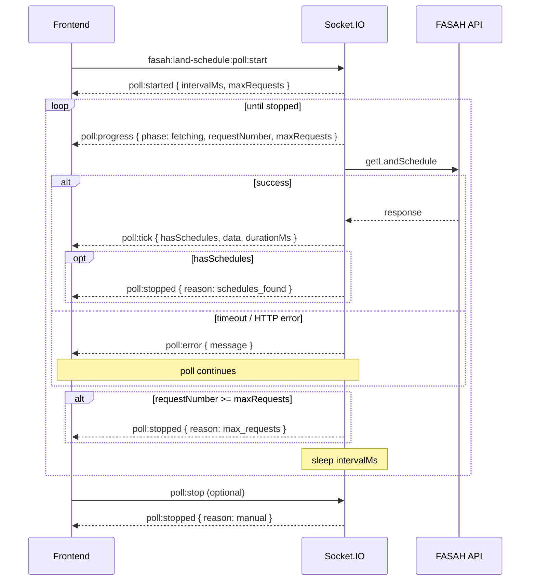
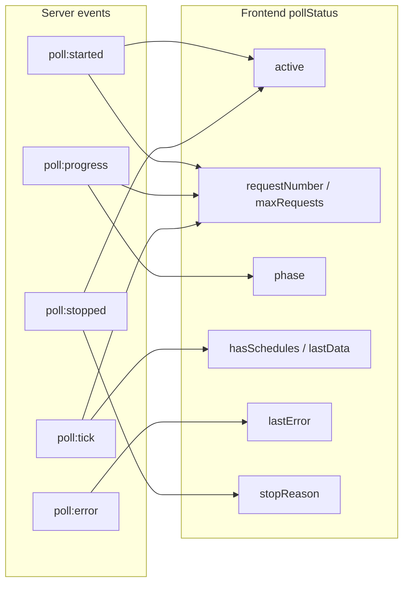
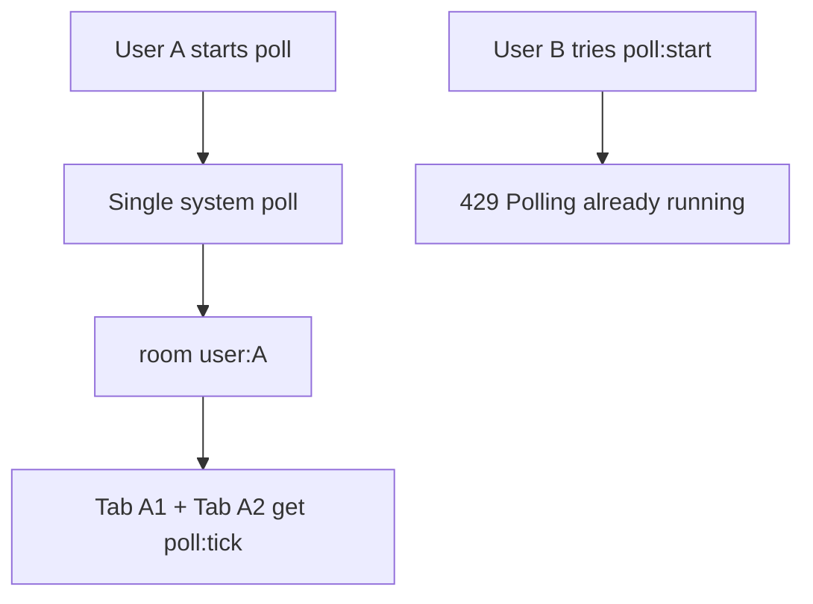
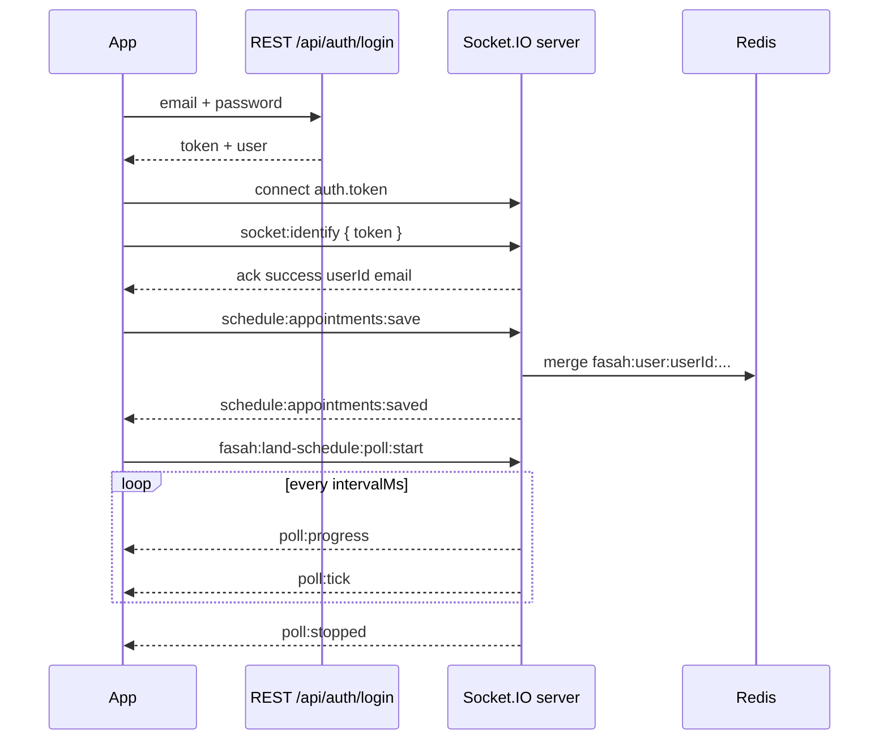

# Socket.IO — Frontend integration guide

This document describes how a browser or mobile app connects to the **Fasah-proxy** Socket.IO server: authentication, per-user Redis appointments, and land-schedule polling.

**Interactive tester:** `GET /socket-test` on the same host as the API (e.g. `http://localhost:3100/socket-test`).

---

## Quick start

```bash
npm install socket.io-client
```

```javascript
import { io } from 'socket.io-client';

const API_BASE = 'http://localhost:3100'; // same origin in production

// 1) REST login → app JWT
const loginRes = await fetch(`${API_BASE}/api/auth/login`, {
  method: 'POST',
  headers: { 'Content-Type': 'application/json' },
  body: JSON.stringify({ email: 'user@example.com', password: 'secret' })
});
const { token, user } = await loginRes.json();
// token: string — use for socket auth
// user._id: Mongo user id

// 2) Connect with JWT in handshake
const socket = io(API_BASE, {
  path: '/socket.io/',
  transports: ['websocket', 'polling'],
  auth: { token }
});

socket.on('connect', () => {
  // 3) Confirm identity (recommended even if handshake bound the user)
  socket.emit('socket:identify', { token }, (reply) => {
    if (!reply.success) console.error(reply.message);
    else console.log('identified', reply.userId, reply.email);
  });
});

// 4) Use events below (appointments, poll, etc.)
```

---

## Connection

| Setting | Value |
|--------|--------|
| URL | Same as HTTP API (`PORT`, default `3100`) |
| Path | `/socket.io/` |
| CORS | Enabled (`origin: true`) |
| Transports | `websocket`, `polling` (client may try both) |

The **app JWT** (from `POST /api/auth/login`) is **not** the FASAH schedule token. You need both for different features:

| Token | Source | Used for |
|-------|--------|----------|
| **App JWT** | `POST /api/auth/login` → `token` | Socket handshake / `socket:identify`, appointments, **land poll** (one per user) |
| **FASAH token** | Your FASAH login flow | `fasah:land-schedule:poll:start` payload only |

---

## Authentication & per-user sockets

### REST login

```http
POST /api/auth/login
Content-Type: application/json

{ "email": "user@example.com", "password": "..." }
```

**Success (200):**

```json
{
  "success": true,
  "message": "Login successful",
  "user": { "_id": "...", "email": "...", "role": "user", ... },
  "token": "<app-jwt>"
}
```

On login, the server may emit **`user-login`** to:

- All sockets in room `user:<userId>`
- All sockets in room `email:<email>`
- A global broadcast (all connected clients)

Payload:

```json
{ "email": "user@example.com", "userId": "507f1f77bcf86cd799439011" }
```

### Handshake auth (optional but recommended)

Pass the app JWT when connecting:

```javascript
io(API_BASE, {
  auth: { token: appJwt }
  // optional checks (must match JWT): userId, email
  // auth: { token, userId: '...', email: '...' }
});
```

Middleware runs **`bindSocketUser`** before `connect`. If the JWT is valid, `socket.data.userId` and `socket.data.email` are set and the socket joins rooms:

- `user:<userId>`
- `email:<email>`

Invalid or missing JWT still allows connection; identification can be done later via `socket:identify`.

### `socket:identify` (client → server)

Bind or re-bind the socket to the logged-in user.

**Emit:**

```javascript
socket.emit('socket:identify', { token: appJwt }, (reply) => { /* ack */ });
```

| Field | Type | Required | Description |
|-------|------|----------|-------------|
| `token` | string | Yes* | App JWT from `/api/auth/login` |
| `userId` | string | No | If set, must match JWT user |
| `email` | string | No | If set, must match JWT user |

\*If omitted, server uses `handshake.auth.token` or header `x-auth-token`.

**Ack / events:**

| Outcome | Callback ack | Event (if no ack callback) |
|---------|----------------|----------------------------|
| OK | `{ success: true, userId, email, role }` | `socket:identified` (same shape) |
| Fail | `{ success: false, message }` | `socket:identify:error` |

**Required for:** `schedule:appointments:save` and `schedule:appointments:get` (server checks `socket.data.userId`).

---

## Event reference

### Summary

| Direction | Event | Purpose |
|-----------|--------|---------|
| → | `socket:identify` | Bind socket to app user (JWT) |
| ← | `socket:identified` | Identify success (no ack callback) |
| ← | `socket:identify:error` | Identify failed |
| ← | `user-login` | User logged in via REST (rooms + broadcast) |
| → | `schedule:appointments:save` | Merge appointments into Redis (per user) |
| → | `schedule:appointments:get` | Load full appointment list (per user) |
| ← | `schedule:appointments:saved` | Save OK |
| ← | `schedule:appointments:data` | Get OK |
| ← | `schedule:appointments:error` | Save/get error |
| → | `fasah:land-schedule:poll:start` | Start polling (one per **userId**) |
| → | `fasah:land-schedule:poll:stop` | Stop this user's poll (manual) |
| → | `fasah:land-schedule:poll:close` | Same as `poll:stop` |
| → | `fasah:land-schedule:poll:status` | Ask if poll is active (reconnect / 2nd tab) |
| ← | `fasah:land-schedule:poll:status` | Reply: `{ active, requestNumber, maxRequests, ... }` |
| ← | `fasah:land-schedule:poll:started` | Poll loop started (all user tabs) |
| ← | `fasah:land-schedule:poll:progress` | Before each HTTP request |
| ← | `fasah:land-schedule:poll:tick` | After each request (includes FASAH body) |
| ← | `fasah:land-schedule:poll:error` | Request/validation error (poll may continue) |
| ← | `fasah:land-schedule:poll:stopped` | Poll ended |

---

## Appointments (Redis, per user)

Data is stored under Redis key:

`fasah:user:<userId>:schedule-appointments`

TTL: **7 days** (refreshed on each save). Survives socket reconnect and new `socket.id`.

**Merge rules:** appointments are merged by `id` (also `appointmentId` / `_id`). Same id → replace; new id → append.

### `schedule:appointments:save` (client → server)

**Requires:** identified user (`socket.data.userId`).

**Payload** (any of these shapes):

```json
{
  "appointments": [
    { "id": "apt-1", "port_code": "31", "note": "..." },
    { "id": "apt-2" }
  ]
}
```

Or a single object with `id`, or a raw array of appointment objects.

**Listen:** `schedule:appointments:saved`

```json
{
  "success": true,
  "userId": "507f...",
  "email": "user@example.com",
  "key": "fasah:user:507f...:schedule-appointments",
  "count": 2,
  "appointments": [ ... ],
  "ttlSeconds": 604800
}
```

**Errors:** `schedule:appointments:error`

```json
{ "message": "Login required: connect with app JWT (auth.token) and socket:identify first" }
```

### `schedule:appointments:get` (client → server)

**Requires:** identified user. No payload.

**Listen:** `schedule:appointments:data`

```json
{
  "userId": "507f...",
  "email": "user@example.com",
  "key": "fasah:user:507f...:schedule-appointments",
  "count": 2,
  "appointments": [ ... ],
  "parsed": { "appointments": [ ... ], "userId": "...", "email": "..." },
  "raw": "<json string or null>"
}
```

Empty store: `count: 0`, `appointments: []`, `raw: null`.

---

## Land schedule poll

Polls upstream **`getLandSchedule`** on an interval until stopped.

**One active poll for the entire server** (only one user at a time). That user's tabs share events via room `user:<userId>`.

| Rule | Behavior |
|------|----------|
| **Requires** | App JWT + `socket:identify` (same as appointments) |
| **Same user, second `poll:start`** | `poll:error` — `status: 409`, `"Poll already running for this user"` |
| **Another user while system busy** | `poll:error` — **`status: 429`**, `"Polling already running"` |
| **Stop** | Only the **owner** user's `poll:stop` ends the system poll |
| **Last tab of owner disconnects** | Poll stops with `reason: "disconnect"` |

FASAH Bearer `token` still goes in the `poll:start` payload (not the app JWT).

### Poll status — diagrams

**Frontend state** (derive from events; there is no REST status API):



**Event sequence** (one request in the loop):



**Which event updates what in your UI:**



### `fasah:land-schedule:poll:start`

**Payload:**

| Field | Type | Required | Default | Description |
|-------|------|----------|---------|-------------|
| `departure` | string | Yes | — | e.g. `"AGF"` |
| `arrival` | string | Yes | — | e.g. `"31"` |
| `type` | string | Yes | — | e.g. `"IMPORT"` |
| `token` | string | Yes | — | FASAH Bearer token (not app JWT) |
| `userType` | string | No | `"broker"` | `"broker"` \| `"transporter"` |
| `economicOperator` | string | No | — | Optional |
| `intervalMs` | number | No | `3000` | Clamped 1000–60000 |
| `maxRequests` | number | No | `200` | Clamped 1–200 |

**Stop conditions:**

| Reason | `fasah:land-schedule:poll:stopped`.reason |
|--------|-------------------------------------------|
| Client `poll:stop` / `poll:close` | `manual` |
| Reached `maxRequests` | `max_requests` |
| Response has non-empty `schedules[]` and `success !== false` | `schedules_found` |
| User has no connected tabs left | `disconnect` |
| Unhandled loop error | `error` |

**Note:** FASAH `success: false` with “no appointments” (e.g. error code `200`) does **not** stop the poll; the loop continues until max requests or schedules are found.

Per-request timeout: `FASAH_POLL_REQUEST_TIMEOUT_MS` (default **20s**). Timeout emits `poll:error` but **continues** polling.

### Server → client (poll)

**`fasah:land-schedule:poll:started`**

```json
{ "intervalMs": 3000, "maxRequests": 200 }
```

**`fasah:land-schedule:poll:progress`** (before each request)

```json
{
  "at": "2026-05-15T15:38:17.022Z",
  "phase": "fetching",
  "requestNumber": 1,
  "maxRequests": 200,
  "active": true
}
```

**`fasah:land-schedule:poll:tick`** (after each request)

```json
{
  "at": "2026-05-15T15:38:20.100Z",
  "requestNumber": 1,
  "maxRequests": 200,
  "hasSchedules": false,
  "stillPolling": true,
  "durationMs": 3100,
  "data": { /* full FASAH getLandSchedule response */ }
}
```

**`fasah:land-schedule:poll:stopped`**

```json
{
  "at": "2026-05-15T15:40:00.000Z",
  "reason": "schedules_found",
  "requestCount": 12,
  "maxRequests": 200
}
```

**`fasah:land-schedule:poll:error`** (non-fatal during loop; fatal on rejected start)

```json
{
  "at": "2026-05-15T15:38:22.000Z",
  "requestNumber": 5,
  "maxRequests": 200,
  "message": "FASAH request timeout after 20000ms ...",
  "status": 502
}
```

Rejected start (another user polling):

```json
{
  "at": "2026-05-15T15:38:22.000Z",
  "message": "Polling already running",
  "status": 429
}
```

### `fasah:land-schedule:poll:stop` / `poll:close`

**Requires:** identified user. No payload. Stops **this user's** poll for all tabs (`reason: "manual"`).

### `fasah:land-schedule:poll:status`

**Requires:** identified user. No payload.

**Listen:** same event name `fasah:land-schedule:poll:status`

```json
{
  "active": true,
  "userId": "507f...",
  "requestNumber": 12,
  "maxRequests": 200,
  "intervalMs": 3000,
  "startedAt": "2026-05-15T15:38:00.000Z"
}
```

When idle: `"active": false`, `"requestNumber": 0`.

When **another user** owns the system poll:

```json
{
  "active": false,
  "userId": "507f...",
  "systemPollActive": true,
  "isOwner": false,
  "status": 429,
  "message": "Polling already running"
}
```

Call after `connect` + `socket:identify` on every tab.

---

### Multi-user behavior



- **User A** polling → **User B** gets `429` on `poll:start` (no second poll).
- **User A**, two tabs → both receive `poll:tick`.
- Before start, call `poll:status` — if `status: 429`, show “another session is polling”.

---

## React example (hooks)

```javascript
import { useEffect, useRef, useState } from 'react';
import { io } from 'socket.io-client';

const API_BASE = import.meta.env.VITE_API_URL;

export function useFasahSocket(appToken) {
  const socketRef = useRef(null);
  const [identified, setIdentified] = useState(null);

  useEffect(() => {
    if (!appToken) return;

    const socket = io(API_BASE, {
      path: '/socket.io/',
      auth: { token: appToken }
    });
    socketRef.current = socket;

    socket.on('connect', () => {
      socket.emit('socket:identify', { token: appToken }, (reply) => {
        if (reply?.success) setIdentified({ userId: reply.userId, email: reply.email });
      });
    });

    socket.on('socket:identified', (reply) => {
      if (reply?.success) setIdentified({ userId: reply.userId, email: reply.email });
    });

    socket.on('user-login', (p) => {
      if (identified?.userId === p.userId) {
        // optional: refresh UI / refetch profile
      }
    });

    return () => {
      socket.disconnect();
      socketRef.current = null;
    };
  }, [appToken]);

  const saveAppointments = (appointments) => {
    socketRef.current?.emit('schedule:appointments:save', { appointments });
  };

  const getAppointments = () => {
    socketRef.current?.emit('schedule:appointments:get');
  };

  const startLandPoll = (params) => {
    socketRef.current?.emit('fasah:land-schedule:poll:start', params);
  };

  const stopLandPoll = () => {
    socketRef.current?.emit('fasah:land-schedule:poll:stop');
  };

  return { socket: socketRef, identified, saveAppointments, getAppointments, startLandPoll, stopLandPoll };
}
```

Subscribe to server events in the same `useEffect` or child components:

```javascript
socket.on('schedule:appointments:data', (payload) => setList(payload.appointments));
socket.on('schedule:appointments:saved', (payload) => setList(payload.appointments));
socket.on('schedule:appointments:error', (e) => setError(e.message));
socket.on('fasah:land-schedule:poll:tick', ({ data, hasSchedules }) => { ... });
socket.on('fasah:land-schedule:poll:stopped', ({ reason }) => { ... });
```

---

## Recommended client flow



1. Login via REST; store `token` securely (memory / httpOnly cookie if you add that layer).
2. `io(url, { auth: { token } })`.
3. On `connect`, emit `socket:identify` and wait for `success: true` before save/get.
4. Listen for `schedule:appointments:*` and `fasah:land-schedule:poll:*`.
5. On logout: `poll:stop`, `disconnect()`, clear token.
6. On reconnect: same token → same Redis appointment list (per `userId`).

---

## Environment (server)

| Variable | Effect on sockets |
|----------|-------------------|
| `PORT` | HTTP + Socket.IO port |
| `REDIS_URL` | Required for appointments (`off` disables save/get) |
| `FASAH_POLL_REQUEST_TIMEOUT_MS` | Per poll HTTP timeout (default 20000) |
| `FASAH_USE_PROXY` | Upstream FASAH calls via proxy rotation |

---

## Troubleshooting

| Symptom | Cause / fix |
|---------|-------------|
| `Login required...` on save/get | Call `socket:identify` with valid app JWT after connect |
| Appointments empty after reconnect | Ensure same user JWT; data is per `userId`, not `socket.id` |
| `status: 429` / `Polling already running` | Another user holds the system poll — wait or retry `poll:status` |
| `status: 409` / same user | Use `poll:stop` or wait for `poll:stopped` |
| Poll stops at N with no schedules | `max_requests` or manual stop; check `poll:stopped.reason` |
| `Redis disabled` | Set `REDIS_URL` on server |
| CORS / connection failed | Use same scheme/host as API or configure reverse proxy for `/socket.io/` |

---

## TypeScript types (optional)

```typescript
export interface IdentifyReply {
  success: boolean;
  userId?: string;
  email?: string;
  role?: 'user' | 'admin';
  message?: string;
}

export interface AppointmentsSaved {
  success: true;
  userId: string;
  email: string | null;
  key: string;
  count: number;
  appointments: Record<string, unknown>[];
  ttlSeconds: number;
}

export interface LandPollStartPayload {
  departure: string;
  arrival: string;
  type: string;
  token: string;
  userType?: 'broker' | 'transporter';
  economicOperator?: string;
  intervalMs?: number;
  maxRequests?: number;
}

export type PollStopReason =
  | 'manual'
  | 'max_requests'
  | 'schedules_found'
  | 'disconnect'
  | 'error';
```

---

## Related files (server)

| File | Role |
|------|------|
| `services/socketService.js` | Socket.IO server, identify handler, rooms |
| `services/socketScheduleHandlers.js` | Appointments + land poll events |
| `services/socketAuth.js` | JWT → user binding, rooms |
| `services/scheduleAppointmentsStore.js` | Redis key + merge logic |
| `public/socket-test.html` | Manual tester UI |
| `routes/authRoutes.js` | `POST /api/auth/login`, `user-login` emit |
